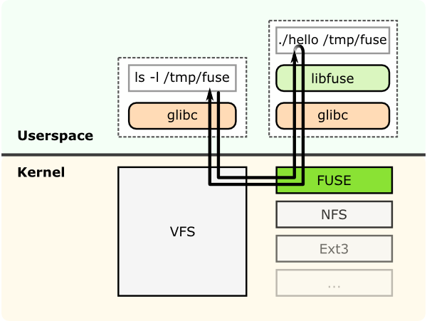

FUSE
----

GlusterFS is a userspace filesystem. This was a decision made by the
GlusterFS developers initially as getting the modules into linux kernel
is a very long and difficult process.

Being a userspace filesystem, to interact with kernel VFS, GlusterFS
makes use of FUSE (File System in Userspace). For a long time,
implementation of a userspace filesystem was considered impossible. FUSE
was developed as a solution for this. FUSE is a kernel module that
support interaction between kernel VFS and non-privileged user
applications and it has an API that can be accessed from userspace.
Using this API, any type of filesystem can be written using almost any
language you prefer as there are many bindings between FUSE and other
languages.

**Structural diagram of FUSE**

This shows a filesystem "hello world" that is compiled to create a
binary "hello". It is executed with a filesystem mount point /tmp/fuse.
Then the user issues a command ls -l on the mount point /tmp/fuse. This
command reaches VFS via glibc and since the mount /tmp/fuse corresponds
to a FUSE based filesystem, VFS passes it over to FUSE module. The FUSE
kernel module contacts the actual filesystem binary "hello" after
passing through glibc and FUSE library in userspace(libfuse). The result
is returned by the "hello" through the same path and reaches the ls -l
command.

The communication between FUSE kernel module and the FUSE
library(libfuse) is via a special file descriptor which is obtained by
opening /dev/fuse. This file can be opened multiple times, and the
obtained file descriptor is passed to the mount syscall, to match up the
descriptor with the mounted filesystem.

-  `More about userspace filesystems <http://www.linux-mag.com/id/7814/>`__
-  `FUSE reference <http://fuse.sourceforge.net/>`__
