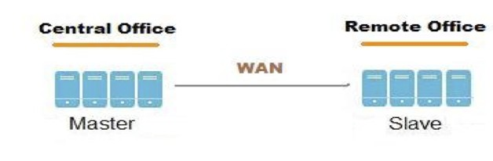

Geo-Replication
^^^^^^^^^^^^^^^

Geo-replication provides asynchronous replication of data across
geographically distinct locations and was introduced in Glusterfs 3.2.
It mainly works across WAN and is used to replicate the entire volume
unlike AFR which is intra-cluster replication. This is mainly useful for
backup of entire data for disaster recovery.

Geo-replication uses a master-slave model, whereby replication occurs
between **Master** - a GlusterFS volume and **Slave** - which can be a
local directory or a GlusterFS volume. The slave (local directory or
volume is accessed using SSH tunnel).

Geo-replication provides an incremental replication service over Local
Area Networks (LANs), Wide Area Network (WANs), and across the Internet.

**Geo-replication over LAN**

You can configure Geo-replication to mirror data over a Local Area
Network.

.. figure:: ../_static/geo-rep-lan.png

**Geo-replication over WAN**

You can configure Geo-replication to replicate data over a Wide Area
Network.

**Geo-replication over Internet**

You can configure Geo-replication to mirror data over the Internet.

.. figure:: ../_static/geo-rep-internet.png

**Multi-site cascading Geo-replication**

You can configure Geo-replication to mirror data in a cascading fashion
across multiple sites.

.. figure:: ../_static/geo-rep-cascading.png

There are mainly two aspects while asynchronously replicating data ine
change detection and replication:

**Change detection** - These include file-operation necessary
details. There are two methods to sync the detected changes namely
a) changelogs and b) xsync:

a. Changelogs - Changelog is a translator which records necessary
details for the fops that occur. The changes can be written in binary
format or ASCII. There are three category with each category
represented by a specific changelog format. All three types of
categories are recorded in a single changelog file.

**Entry** - create(), mkdir(), mknod(), symlink(), link(), rename(),
unlink(), rmdir()

**Data** - write(), writev(), truncate(), ftruncate()

**Meta** - setattr(), fsetattr(), setxattr(), fsetxattr(),
removexattr(), fremovexattr()

In order to record the type of operation and entity underwent, a type
identifier is used. Normally, the entity on which the operation is
performed would be identified by the pathname, but we choose to use
GlusterFS internal file identifier (GFID) instead (as GlusterFS supports
GFID based backend and the pathname field may not always be valid and
other reasons which are out of scope of this this document). Therefore,
the format of the record for the three types of operation can be
summarized as follows:

Entry - GFID + FOP + MODE + UID + GID + PARGFID/BNAME [PARGFID/BNAME]

Meta - GFID of the file

Data - GFID of the file

GFID's are analogous to inodes. Data and Meta fops record the GFID of
the entity on which the operation was performed, thereby recording that
there was a data/metadata change on the inode. Entry fops record at the
minimum a set of six or seven records (depending on the type of
operation), that is sufficient to identify what type of operation the
entity underwent. Normally this record includes the GFID of the entity,
the type of file operation (which is an integer [an enumerated value
which is used in Glusterfs]) and the parent GFID and the basename
(analogous to parent inode and basename).

Changelog file is rolled over after a specific time interval. We then
perform processing operations on the file like converting it to
understandable/human readable format, keeping private copy of the
changelog etc. The library then consumes these logs and serves
application requests.

b. Xsync - Marker translator maintains an extended attribute “xtime”
for each file and directory. Whenever any update happens it would
update the xtime attribute of that file and all its ancestors. So
the change is propagated from the node (where the change has
occurred) all the way to the root.

Consider the above directory tree structure. At time T1 the master and
slave were in sync each other.

At time T2 a new file File2 was created. This will trigger the xtime
marking (where xtime is the current timestamp) from File2 upto to the
root, i.e, the xtime of File2, Dir3, Dir1 and finally Dir0 all will be
updated.

Geo-replication daemon crawls the file system based on the condition
that xtime(master) > xtime(slave). Hence in our example it would crawl
only the left part of the directory structure since the right part of
the directory structure still has equal timestamp. Although the crawling
algorithm is fast we still need to crawl a good part of the directory
structure.

**Replication** - We use rsync for data replication. Rsync is an
external utility which will calculate the diff of the two files and
sends this difference from source to sync.
