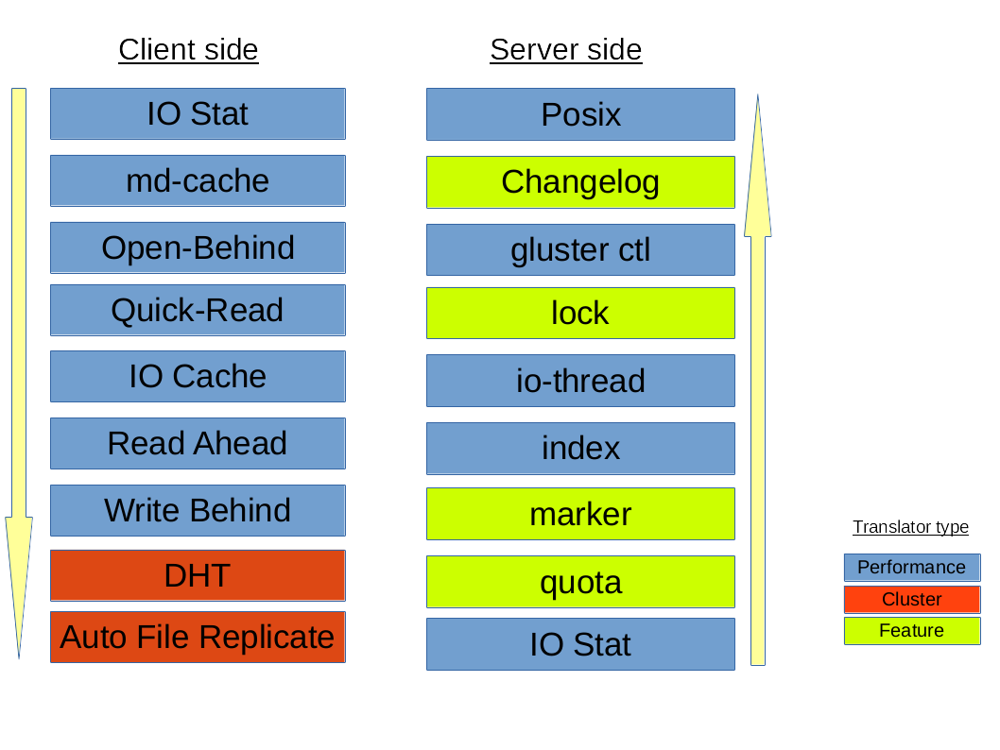
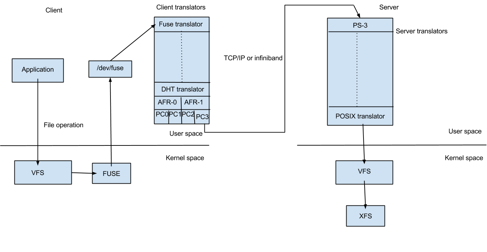

===========
Translators
===========

**Translating "translators"**:

-  A translator converts requests from users into requests for storage.
   One to one, one to many, one to zero (e.g. caching)
   .. figure:: ../_static/xlator.png

-  A translator can modify requests on the way through :

   - convert one request type to another ( during the request transfer amongst the translators)
   - modify paths, flags, even data (e.g. encryption)

-  Translators can intercept or block the requests. (e.g. access
   control)
-  Or spawn new requests (e.g. pre-fetch)

**How Do Translators Work?**

-  Translators are implemented as shared objects
-  Dynamically loaded according to 'volfile'

   - dlopen/dlsync (setup pointers to parents/children)
   - call init (constructor) (call IO functions through fops)

-  There are conventions for validating/passing options, etc.
-  The configuration of translators (since GlusterFS 3.1) is managed
   through the gluster command line interface (cli), so you don't need
   to know in what order to graph the translators together.

Types of Translators
^^^^^^^^^^^^^^^^^^^^

List of known translators with their current status.

+-------------------+----------------------------------------------------------------------------------------------------------------+
| Translator Type   | Functional Purpose                                                                                             |
+===================+================================================================================================================+
| Storage           | Lowest level translator, stores and accesses data from local file system.                                      |
+-------------------+----------------------------------------------------------------------------------------------------------------+
| Debug             | Provide interface and statistics for errors and debugging.                                                     |
+-------------------+----------------------------------------------------------------------------------------------------------------+
| Cluster           | Handle distribution and replication of data as it relates to writing to and reading from bricks & nodes.       |
+-------------------+----------------------------------------------------------------------------------------------------------------+
| Encryption        | Extension translators for on-the-fly encryption/decryption of stored data.                                     |
+-------------------+----------------------------------------------------------------------------------------------------------------+
| Protocol          | Extension translators for client/server communication protocols.                                               |
+-------------------+----------------------------------------------------------------------------------------------------------------+
| Performance       | Tuning translators to adjust for workload and I/O profiles.                                                    |
+-------------------+----------------------------------------------------------------------------------------------------------------+
| Bindings          | Add extensibility, e.g. The Python interface written by Jeff Darcy to extend API interaction with GlusterFS.   |
+-------------------+----------------------------------------------------------------------------------------------------------------+
| System            | System access translators, e.g. Interfacing with file system access control.                                   |
+-------------------+----------------------------------------------------------------------------------------------------------------+
| Scheduler         | I/O schedulers that determine how to distribute new write operations across clustered systems.                 |
+-------------------+----------------------------------------------------------------------------------------------------------------+
| Features          | Add additional features such as Quotas, Filters, Locks, etc.                                                   |
+-------------------+----------------------------------------------------------------------------------------------------------------+

The default/general hierarchy of translators in vol files :

All the translators hooked together to perform a function is called a
graph. The left-set of translators comprises of **Client-stack**.The
right-set of translators comprises of **Server-stack**.

**The glusterfs translators can be sub-divided into many categories, but
two important categories are - Cluster and Performance translators :**

One of the most important and the first translator the data/request has
to go through is **fuse translator** which falls under the category of
**Mount Translators**.

**Cluster Translators**:

   - DHT(Distributed Hash Table)
   - AFR(Automatic File Replication)

**Performance Translators**:

   - io-cache
   - io-threads
   - md-cache
   - open behind
   - quick read
   - read-ahead
   - readdir-ahead
   - write-behind

Other **Feature Translators** include:

   - changelog
   - locks: provides internal locking operations called  ``inodelk`` and ``entrylk`` which are used by AFR to achieve synchronization of operations on files or directories that conflict with each other.
   - marker
   - quota

**Debug Translators**

   - trace
   - io-stats

DHT(Distributed Hash Table) Translator
^^^^^^^^^^^^^^^^^^^^^^^^^^^^^^^^^^^^^^

**What is DHT?**

DHT is the real core of how GlusterFS aggregates capacity and
performance across multiple servers. Its responsibility is to place each
file on exactly one of its subvolumes – unlike either replication (which
places copies on all of its subvolumes) or striping (which places pieces
onto all of its subvolumes). It’s a routing function, not splitting or
copying.

**How DHT works**?

The basic method used in DHT is consistent hashing. Each subvolume
(brick) is assigned a range within a 32-bit hash space, covering the
entire range with no holes or overlaps. Then each file is also assigned
a value in that same space, by hashing its name. Exactly one brick will
have an assigned range including the file’s hash value, and so the file
“should” be on that brick. However, there are many cases where that
won’t be the case, such as when the set of bricks (and therefore the
range assignment of ranges) has changed since the file was created, or
when a brick is nearly full. Much of the complexity in DHT involves
these special cases, which we’ll discuss in a moment.

When you open() a file, the distribute translator is giving one piece of
information to find your file, the file-name. To determine where that
file is, the translator runs the file-name through a hashing algorithm
in order to turn that file-name into a number.

**A few Observations of DHT hash-values assignment**:

1. The assignment of hash ranges to bricks is determined by extended
   attributes stored on directories, hence distribution is
   directory-specific.
2. Consistent hashing is usually thought of as hashing around a circle,
   but in GlusterFS it’s more linear. There’s no need to “wrap around”
   at zero, because there’s always a break (between one brick’s range
   and another’s) at zero.
3. If a brick is missing, there will be a hole in the hash space. Even
   worse, if hash ranges are reassigned while a brick is offline, some
   of the new ranges might overlap with the (now out of date) range
   stored on that brick, creating a bit of confusion about where files
   should be.

AFR(Automatic File Replication) Translator
^^^^^^^^^^^^^^^^^^^^^^^^^^^^^^^^^^^^^^^^^^

The Automatic File Replication (AFR) translator in GlusterFS makes use
of the extended attributes to keep track of the file operations.It is
responsible for replicating the data across the bricks.

Responsibilities of AFR
'''''''''''''''''''''''

Its responsibilities include the following:

1. Maintain replication consistency (i.e. Data on both the bricks should
   be same, even in the cases where there are operations happening on
   same file/directory in parallel from multiple applications/mount
   points as long as all the bricks in replica set are up).
2. Provide a way of recovering data in case of failures as long as there
   is at least one brick which has the correct data.
3. Serve fresh data for read/stat/readdir etc.

Overall working of GlusterFS
~~~~~~~~~~~~~~~~~~~~~~~~~~~~

As soon as GlusterFS is installed in a server node, a gluster management
daemon(glusterd) binary will be created. This daemon should be running
in all participating nodes in the cluster. After starting glusterd, a
trusted server pool(TSP) can be created consisting of all storage server
nodes (TSP can contain even a single node). Now bricks which are the
basic units of storage can be created as export directories in these
servers. Any number of bricks from this TSP can be clubbed together to
form a volume.

Once a volume is created, a glusterfsd process starts running in each of
the participating brick. Along with this, configuration files known as
vol files will be generated inside /var/lib/glusterd/vols/. There will
be configuration files corresponding to each brick in the volume. This
will contain all the details about that particular brick. Configuration
file required by a client process will also be created. Now our
filesystem is ready to use. We can mount this volume on a client machine
very easily as follows and use it like we use a local storage:

.. code-block:: console

    # mount.glusterfs <IP or hostname>:<volume_name> <mount_point>

IP or hostname can be that of any node in the trusted server pool in
which the required volume is created.

When we mount the volume in the client, the client glusterfs process
communicates with the servers’ glusterd process. Server glusterd process
sends a configuration file (vol file) containing the list of client
translators and another containing the information of each brick in the
volume with the help of which the client glusterfs process can now
directly communicate with each brick’s glusterfsd process. The setup is
now complete and the volume is now ready for client's service.

When a system call (File operation or Fop) is issued by client in the
mounted filesystem, the VFS (identifying the type of filesystem to be
glusterfs) will send the request to the FUSE kernel module. The FUSE
kernel module will in turn send it to the GlusterFS in the userspace of
the client node via /dev/fuse (this has been described in FUSE section).
The GlusterFS process on the client consists of a stack of translators
called the client translators which are defined in the configuration
file(vol file) send by the storage server glusterd process. The first
among these translators being the FUSE translator which consists of the
FUSE library(libfuse). Each translator has got functions corresponding
to each file operation or fop supported by glusterfs. The request will
hit the corresponding function in each of the translators. Main client
translators include:

-  FUSE translator
-  DHT translator- DHT translator maps the request to the correct brick
   that contains the file or directory required.
-  AFR translator- It receives the request from the previous translator
   and if the volume type is replicate, it duplicates the request and
   pass it on to the Protocol client translators of the replicas.
-  Protocol Client translator- Protocol Client translator is the last in
   the client translator stack. This translator is divided into multiple
   threads, one for each brick in the volume. This will directly
   communicate with the glusterfsd of each brick.

In the storage server node that contains the brick in need, the request
again goes through a series of translators known as server translators,
main ones being:

-  Protocol server translator
-  POSIX translator

The request will finally reach VFS and then will communicate with the
underlying native filesystem. The response will retrace the same path.
