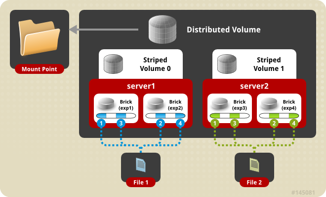

============
Volume Types
============

Volume is the collection of bricks and most of the gluster file system
operations happen on the volume. Gluster file system supports different
types of volumes based on the requirements. Some volumes are good for
scaling storage size, some for improving performance and some for both.

**Distributed Volume** - This is the default glusterfs
volume i.e, while creating a volume if you do not specify the type of
the volume, the default option is to create a distributed volume. Here,
files are distributed across various bricks in the volume. So file1 may
be stored only in brick1 or brick2 but not on both. Hence there is no
data redundancy. The purpose for such a storage volume is to easily &
cheaply scale the volume size. However this also means that a brick
failure will lead to complete loss of data and one must rely on the
underlying hardware for data loss protection.

.. figure:: ../_static/dist-volume.png

Create a Distributed Volume

**gluster volume create NEW-VOLNAME [transport [tcp \| rdma \|
tcp,rdma]] NEW-BRICK...**

For example, to create a distributed volume with four storage servers
using TCP.

.. code-block:: console

    # gluster volume create test-volume server1:/exp1 server2:/exp2 server3:/exp3 server4:/exp4
      Creation of test-volume has been successful
      Please start the volume to access data

To display the volume info

.. code-block:: console

    # gluster volume info
      Volume Name: test-volume
      Type: Distribute
      Status: Created
      Number of Bricks: 4
      Transport-type: tcp
      Bricks:
      Brick1: server1:/exp1
      Brick2: server2:/exp2
      Brick3: server3:/exp3
      Brick4: server4:/exp4

**Replicated Volume** - In this volume we overcome the
data loss problem faced in the distributed volume. Here exact copies of
the data are maintained on all bricks. The number of replicas in the
volume can be decided by client while creating the volume. So we need to
have at least two bricks to create a volume with 2 replicas or a minimum
of three bricks to create a volume of 3 replicas. One major advantage of
such a volume is that even if one brick fails the data can still be
accessed from its replicated bricks. Such a volume is used for better
reliability and data redundancy.

.. figure:: ../_static/rep-volume.png

Create a Replicated Volume

**gluster volume create NEW-VOLNAME [replica COUNT] [transport [tcp \|
rdma \| tcp,rdma]] NEW-BRICK...**

For example, to create a replicated volume with two storage servers:

.. code-block:: console

    # gluster volume create test-volume replica 2 transport tcp server1:/exp1 server2:/exp2
      Creation of test-volume has been successful
      Please start the volume to access data

**Distributed Replicated Volume** - In this volume files
are distributed across replicated sets of bricks. The number of bricks
must be a multiple of the replica count. Also the order in which we
specify the bricks matters since adjacent bricks become replicas of each
other. This type of volume is used when high availability of data due to
redundancy and scaling storage is required. So if there were eight
bricks and replica count 2 then the first two bricks become replicas of
each other then the next two and so on. This volume is denoted as 4x2.
Similarly if there were eight bricks and replica count 4 then four
bricks become replica of each other and we denote this volume as 2x4
volume.

.. figure:: ../_static/dist-rep-volume.png

Create the distributed replicated volume:

**# gluster volume create NEW-VOLNAME [replica COUNT] [transport [tcp \|
rdma \| tcp,rdma]] NEW-BRICK...**

For example, four node distributed (replicated) volume with a
two-way mirror:

.. code-block:: console

    # gluster volume create test-volume replica 2 transport tcp server1:/exp1 server2:/exp2 server3:/exp3 server4:/exp4
      Creation of test-volume has been successful
      Please start the volume to access data

**Striped Volume** - Consider a large file being stored in
a brick which is frequently accessed by many clients at the same time.
This will cause too much load on a single brick and would reduce the
performance. In striped volume the data is stored in the bricks after
dividing it into different stripes. So the large file will be divided
into smaller chunks (equal to the number of bricks in the volume) and
each chunk is stored in a brick. Now the load is distributed and the
file can be fetched faster but no data redundancy provided.

.. figure:: ../_static/stripe-volume.png

Create a Striped Volume

**#gluster volume create NEW-VOLNAME [stripe COUNT] [transport [tcp | dma | tcp,rdma]] NEW-BRICK...**

For example, to create a striped volume across two storage servers:

.. code-block:: console

    # gluster volume create test-volume stripe 2 transport tcp server1:/exp1 server2:/exp2
      Creation of test-volume has been successful
      Please start the volume to access data

**Distributed Striped Volume** - This is similar to
Striped Glusterfs volume except that the stripes can now be distributed
across more number of bricks. However the number of bricks must be a
multiple of the number of stripes. So if we want to increase volume size
we must add bricks in the multiple of stripe count.

Create the distributed striped volume:

**gluster volume create NEW-VOLNAME [stripe COUNT] [transport [tcp \|
rdma \| tcp,rdma]] NEW-BRICK...**

For example, to create a distributed striped volume across eight storage
servers:

.. code-block:: console

    # gluster volume create test-volume stripe 4 transport tcp server1:/exp1 server2:/exp2 server3:/exp3 server4:/exp4 server5:/exp5 server6:/exp6 server7:/exp7 server8:/exp8
      Creation of test-volume has been successful
      Please start the volume to access data.
